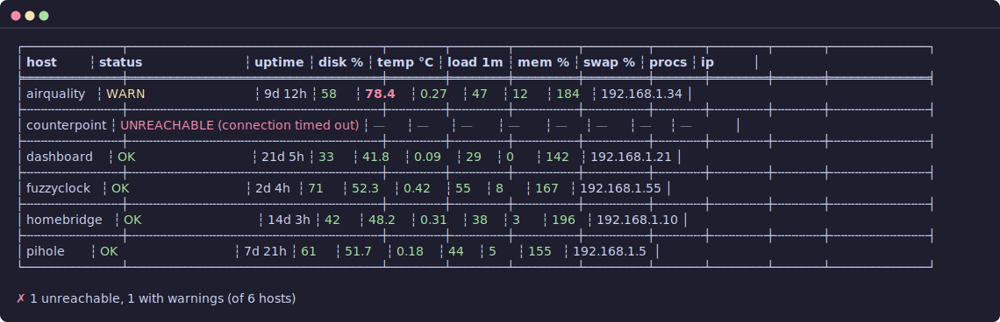

# fleetcheck

A single-binary Rust CLI that reports the health of a fleet of Linux hosts
over SSH. Built for a small home Raspberry Pi fleet plus one Ubuntu box,
and designed to run cleanly from cron.

On each run, fleetcheck connects to every host concurrently and collects:

- uptime
- root-partition disk usage
- CPU temperature (where `/sys/class/thermal/thermal_zone0/temp` exists)
- 1-minute load average
- memory usage %
- swap usage % (where swap is configured)
- process count
- primary IP address (from `hostname -I`)

Hosts that don't answer SSH are reported as `UNREACHABLE`. Results render
as a colored table, or as JSON with `--json`. The process exits non-zero
when any host is unreachable or any configured threshold is crossed.



## Setup (fresh Mac)

The steps below take a fresh Mac from out-of-the-box to a working
`fleetcheck` on your `$PATH`. They assume macOS 12+ on Apple Silicon or
Intel; earlier versions of macOS work too but aren't tested.

### 1. Install Xcode Command Line Tools

This brings in `git`, `cc`, and the linker that `cargo` needs.

```sh
xcode-select --install
```

Accept the GUI prompt and wait for it to finish.

### 2. Install Rust

Use the official installer. No Homebrew needed — `rustup` manages its own
toolchains and keeps them current.

```sh
curl --proto '=https' --tlsv1.2 -sSf https://sh.rustup.rs | sh
```

Pick the default (stable) toolchain at the prompt, then reload your shell
so `~/.cargo/bin` is on `$PATH`:

```sh
source "$HOME/.cargo/env"
rustc --version   # expect 1.85 or newer
```

If you already had Rust installed and it's older than 1.85, update it
before continuing — fleetcheck's dependency tree pulls in crates that use
the 2024 edition, which requires rustc 1.85+. Pick the command that
matches how you installed Rust:

```sh
rustup update stable    # rustup-managed toolchain
brew upgrade rust       # Homebrew-managed toolchain
```

If neither command is available (you have an old, manually-installed
Rust), rerun the `curl … | sh` installer above. It takes over cleanly
from any prior install.

### 3. Confirm `ssh` is present

macOS ships with OpenSSH, so there's nothing to install — just
double-check it's there:

```sh
ssh -V
```

### 4. Set up passwordless SSH to the fleet

Skip this if you've already copied keys over. Otherwise, generate a key
(if `~/.ssh/id_ed25519` doesn't exist yet) and push it to each host:

```sh
ssh-keygen -t ed25519 -C "$(whoami)@$(hostname)"   # press Enter for defaults
for host in homebridge pihole fuzzyclock airquality dashboard counterpoint; do
    ssh-copy-id "$host"
done
```

Store the key in the macOS keychain so `ssh-agent` serves it automatically
across reboots. On modern macOS, `ssh` picks this up via `ssh-agent`
without any extra config:

```sh
ssh-add --apple-use-keychain ~/.ssh/id_ed25519
```

Verify each host answers without prompting:

```sh
for host in homebridge pihole fuzzyclock airquality dashboard counterpoint; do
    ssh -o BatchMode=yes "$host" true && echo "$host ok" || echo "$host FAILED"
done
```

Fix any failures before moving on — fleetcheck will report unfixed hosts
as `UNREACHABLE`.

### 5. Install fleetcheck

```sh
git clone <this repo> ~/src/fleetcheck
cd ~/src/fleetcheck
cargo install --locked --path .
```

`cargo install` drops a release-mode `fleetcheck` binary in
`~/.cargo/bin/`, which is already on `$PATH` from step 2. Verify:

```sh
fleetcheck --version
```

To work in-tree without installing, use `cargo run --release -- <args>`
instead.

### 6. Create the config

```sh
mkdir -p ~/.config/fleetcheck
$EDITOR ~/.config/fleetcheck/hosts.toml
```

See the [Configuration](#configuration) section below for the schema, then
run `fleetcheck` — you should see a colored table of the fleet.

### Remote requirements

Each host needs POSIX `sh` plus `awk`, `df`, `free`, `ps`, and
`hostname`. All five are present by default on Raspberry Pi OS and
Ubuntu, so no remote setup is required. (`hostname -I` powers the IP
column; on minimal distros without that flag, the IP cell shows `—`.)

## Configuration

fleetcheck reads a TOML file at `~/.config/fleetcheck/hosts.toml` by default
(override with `--config <path>`).

```toml
# Default thresholds; tripped values render red and make the run exit 1.
[thresholds]
disk_pct   = 85      # root partition used %
temp_c     = 75.0    # CPU °C
load_1m    = 2.0     # 1-minute load average
mem_pct    = 90      # used memory %
swap_pct   = 50      # used swap %               (optional, v2+)
proc_count = 500     # number of processes       (optional, v2+)

# Threshold any other metric the script emits — including future ones the
# binary doesn't know about yet. Strictly `>` is a violation, same as the
# typed thresholds. Keys must match the script's key=value names. Valid
# keys today: disk_pct, temp_c, load_1m, mem_pct, swap_pct, proc_count,
# uptime_secs (any future script.sh keys also work — unknown keys are
# silently skipped).
#
# A custom-map entry whose key names a typed metric SHADOWS the typed
# check: only the custom limit fires, so users can raise or lower a
# typed threshold without producing two violations for the same metric.
[thresholds.custom]
uptime_secs = 31536000   # warn after a year of uptime
disk_pct    = 90.0       # shadows the typed disk_pct = 85 above

# Minimal host entry: the table key is both the label and the SSH destination.
[hosts.homebridge]
[hosts.pihole]
[hosts.airquality]
[hosts.dashboard]

# Override per host when the defaults don't fit — e.g. a tiny SD card
# that runs near full on purpose.
[hosts.fuzzyclock]

[hosts.fuzzyclock.thresholds]
disk_pct = 95

# Full form: custom address, user, port. Per-host retry override is
# useful for hosts on a flaky network — see --retries below.
[hosts.counterpoint]
addr = "counterpoint.lan"
user = "gkoch"
port = 22
retries = 2
```

**Field reference (host table):**

| Field        | Default                  | Notes                                  |
|--------------|--------------------------|----------------------------------------|
| `addr`       | the table key            | Hostname or IP passed to `ssh`.        |
| `user`       | from `~/.ssh/config`, else local user | Override when the remote user differs. |
| `port`       | from `~/.ssh/config`, else 22 | Override for non-standard ports. |
| `thresholds` | global `[thresholds]`    | Any subset of the typed threshold keys, plus an optional `custom` map. |
| `retries`    | global `--retries`       | Per-host retry count for SSH connect failures. |

**Field reference (`[thresholds]`):**

| Field         | Type | Required | Notes                                         |
|---------------|------|----------|-----------------------------------------------|
| `disk_pct`    | u8   | yes      | Root partition used %.                        |
| `temp_c`      | f32  | yes      | CPU °C; skipped on hosts without a thermal zone. |
| `load_1m`     | f32  | yes      | 1-minute load average.                        |
| `mem_pct`     | u8   | yes      | Used memory %.                                |
| `swap_pct`    | u8   | no       | Used swap %; skipped on hosts without swap.   |
| `proc_count`  | u32  | no       | Process count.                                |
| `custom`      | map  | no       | Additional metric → upper-bound thresholds. Strictly `>` trips a violation. Unknown keys silently skipped. |

fleetcheck shells out through the system `ssh`, so anything configurable
in `~/.ssh/config` (jump hosts, identity files, host aliases) is honored
automatically.

## Usage

```sh
fleetcheck                            # colored table
fleetcheck --json                     # machine-readable output
fleetcheck --config ./other.toml      # alternate config path
fleetcheck --connect-timeout 5        # SSH connect timeout (default 5s)
fleetcheck --script-timeout 5         # remote script timeout (default 5s)
fleetcheck --retries 2                # retry SSH connect with backoff (default 0)
fleetcheck --max-concurrent 8         # cap parallel hosts (default 32, 0=unbounded)
```

`--timeout-secs N` is still accepted as a deprecated alias that sets both
`--connect-timeout` and `--script-timeout` to `N`, so existing cron lines
keep working.

### Reliability flags

- `--connect-timeout` bounds the TCP+SSH handshake. A host that doesn't
  answer within this budget is recorded as `UNREACHABLE`.
- `--script-timeout` bounds the remote metric-collection script
  separately, so a slow but reachable host can finish without forcing the
  connect timeout up.
- `--retries N` retries only the connect phase up to `N` times with
  exponential backoff (200ms doubling, capped at 5s) plus ±20% jitter.
  Default is `0` (v1 behavior). A successful connect that then fails is
  not retried.
- `--max-concurrent N` caps how many hosts are checked in parallel,
  preventing a 100-host fleet from opening 100 SSH sessions at once.
  `--max-concurrent 0` is unbounded.

### Exit codes

| Code | Meaning                                                             |
|------|---------------------------------------------------------------------|
| 0    | All hosts reachable, no thresholds exceeded.                        |
| 1    | At least one host unreachable, or at least one threshold exceeded.  |
| 2    | Config missing/invalid, or an unrecoverable internal error.         |

### Cron example (macOS)

Run every five minutes; pop a desktop notification when fleetcheck exits
non-zero:

```cron
*/5 * * * * /Users/gkoch/.cargo/bin/fleetcheck --json > /tmp/fleetcheck.json 2>&1 || /usr/bin/osascript -e 'display notification "fleet unhealthy" with title "fleetcheck"'
```

If you want cron to read files outside `/tmp`, grant Full Disk Access to
`/usr/sbin/cron` under System Settings → Privacy & Security → Full Disk
Access. `launchd` is the more native alternative if cron gives you
trouble.

## Verification / smoke tests

After setup, run through these to confirm the install works end-to-end:

1. **Happy path**
   ```sh
   fleetcheck
   echo "exit=$?"
   ```
   Expect: a colored table, a `✓ all N hosts healthy` summary line, and
   `exit=0`.

2. **JSON output parses and matches the table**
   ```sh
   fleetcheck --json | jq .
   ```
   Expect: a top-level `{ "thresholds": {...}, "hosts": [...] }` object,
   one entry per host, sorted by name, same numbers as the table.

3. **Threshold violation triggers a non-zero exit**
   Temporarily edit `~/.config/fleetcheck/hosts.toml` to set an
   impossibly tight threshold, e.g. `disk_pct = 1`:
   ```sh
   fleetcheck; echo "exit=$?"
   ```
   Expect: offending cells render red and bold, the status column reads
   `WARN`, the summary line starts with a red `✗`, and `exit=1`.

4. **Unreachable host**
   Power off one host (or add a fake entry pointing at an unreachable
   address) and rerun:
   ```sh
   fleetcheck; echo "exit=$?"
   ```
   Expect: that host's row shows `UNREACHABLE (...)` in red with em-dashes
   in the metric columns, and `exit=1`.

5. **Missing config — hard error path**
   ```sh
   fleetcheck --config /does/not/exist; echo "exit=$?"
   ```
   Expect: a single-line error like `fleetcheck: reading config at
   /does/not/exist: No such file or directory (os error 2)`, and `exit=2`.

6. **Non-TTY output is plain**
   ```sh
   fleetcheck | cat
   ```
   Expect: no ANSI color escapes in the piped output. Both comfy-table
   and owo-colors detect the non-TTY sink and disable color.

## Development

```sh
cargo check                               # fast type-check
cargo clippy --all-targets -- -D warnings # lints, warnings as errors
cargo test                                # unit tests (parsing, merging, eval)
cargo build --release                     # optimized binary
```

### Layout

```
src/
  main.rs     # entry, exit codes, tokio runtime
  cli.rs      # clap derive struct
  config.rs   # Config / Thresholds / PartialThresholds + load()
  metrics.rs  # Metrics struct, key=value parser, uptime formatter
  ssh.rs      # openssh Session + run_script (native-mux)
  script.sh   # bundled metric collector, included via include_str!
  check.rs    # per-host orchestration + threshold evaluation
  report.rs   # table (comfy-table) + JSON + summary line (owo-colors)
```

### Extending with a new metric

1. Add one `key=value` line to `src/script.sh`.
2. Add an `Option<...>` field to `Metrics` in `src/metrics.rs` and handle
   the new key in `parse()`. Use `Option` so old binaries running against
   a newer script keep working.
3. (Optional) Either add a typed threshold in `src/config.rs` plus a
   `Violation` check in `src/check.rs::evaluate`, or expose the new
   metric to `[thresholds.custom]` by adding it to
   `metric_value_by_name` in `src/check.rs`.
4. Add a column in `src/report.rs`.

The parser ignores unknown keys, so an updated script can roll out ahead
of the binary without breaking existing deployments. Likewise,
`[thresholds.custom]` keys that don't match any known metric are silently
skipped, so configs can be staged ahead of binary upgrades.
